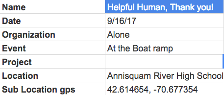
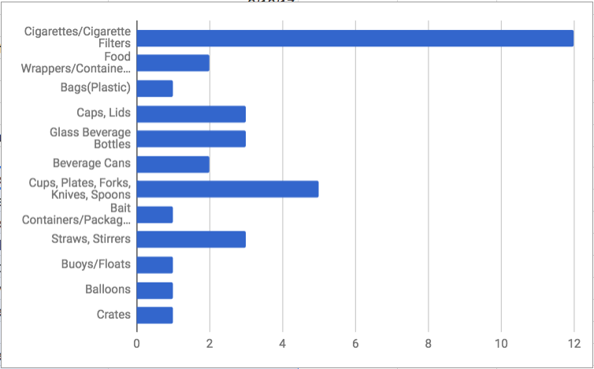

 
We all can do our part to make our beaches clean.
 
It's as simple as being a *C.R.a.B*!

## 1. Collect
See something? Pick it up! Don't just ignore that empty can or other debris laying in the sand. [Collect](/collect) it and move it off the beach, before the ocean does.

## 2. Report
Help Report [data](/data) so we can measure and learn how to prevent  and solve

## 3. and.. Beautify!
Leave the beach better then you found it! Ask yourself what is the one thing you could do at your beach trip to make that beach better for someone else.

## Latest Report

Thank you (name) !

	
 

Attention: This is a prototype site for Hack for the sea 2017. You can find more information [here](https://devpost.com/software/beachcrab).

