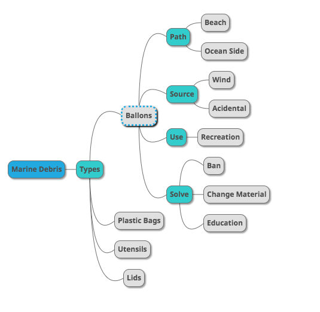

## Solve
Collecting debris is great!  We also need to understand where it comes from and prevent it.

### Root Cause Analysis
Using these reports you can discover where debris comes from and contribute to prevention.

This is an example of how we could mine data to identify solutions

### Schema

[An example of Schema](https://docs.google.com/spreadsheets/d/18MIBhkiBbf9EOcREIDX0Ler0YxtlkBAwlPsnmqcGKLg/edit?usp=sharing) used to link debris to root causes for trends and reporting

